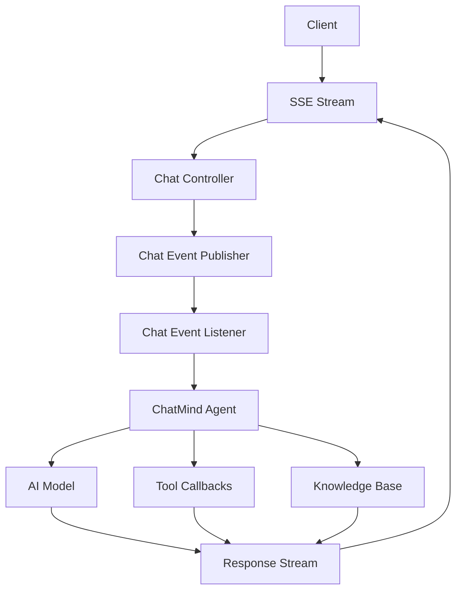

<div align="center">

# 🧠 XChatMind - AI Intelligent Chat Engine

[](https://spring.io/projects/spring-boot)
[](https://www.oracle.com/java/technologies/javase/jdk17-archive-downloads.html)
[](https://www.postgresql.org/) 
[](https://spring.io/projects/spring-ai)


**🚀 An AI-powered intelligent chat system supporting multi-model integration, RAG retrieval enhancement, and knowledge base management**

</div>

---

## Language Switch | 语言切换 | 言語切替

<div style="display: flex; justify-content: center; gap: 10px; margin: 20px 0;">
  <details open>
    <summary><strong>English</strong></summary>
    
## ✨ Key Features

### 🧠 AI Intelligent Agent
- **Multi-model Support**: Integrates mainstream AI models like OpenAI, ZhipuAI, and DeepSeek
- **Intelligent Decision**: Chain-of-thought based autonomous decision agent
- **Tool Calling**: Supports custom tools and function calls

### 📚 RAG Knowledge Retrieval
- **Vector Database**: Vector similarity search based on PostgreSQL
- **Document Parsing**: Smart parsing of multiple document formats
- **Knowledge Management**: Complete knowledge base lifecycle management

### ⚡ Real-time Interaction
- **SSE Streaming**: Server-Sent Events for real-time streaming output
- **Asynchronous Processing**: Spring Event-based asynchronous event processing
- **Bidirectional Communication**: WebSocket-style real-time messaging

### 🔧 Tech Stack
- **Backend Framework**: Spring Boot 3.5.8 + Spring WebMvc
- **AI Framework**: Spring AI 1.1.0
- **Database**: PostgreSQL + MyBatis
- **Documentation**: Knife4j API Documentation

---

## 🏗️ System Architecture



### Core Components

#### 🤖 ChatMind Intelligent Agent
```java
public class ChatMind {
    private String agentId;           // Agent identifier
    private ChatClient chatClient;    // AI chat client
    private List<ToolCallback> tools; // Available tools
    private ChatMemory chatMemory;    // Conversation memory
    private SseService sseService;    // SSE service
}
```

#### 📚 RAG Service
- **Vector Embedding**: Uses bge-m3 model for text vectorization
- **Similarity Search**: PostgreSQL pgvector extension
- **Document Chunking**: Intelligent document splitting algorithm

#### 🔄 Real-time Stream Processing
- **SSE Emitter**: Server-Sent Events real-time messaging
- **Event-driven**: Spring Event asynchronous processing
- **State Management**: Agent state machine pattern

---

## 🚀 Quick Start

### Environment Preparation
```bash
# Java 17 Environment
java -version

# PostgreSQL Database
docker run --name postgres -e POSTGRES_PASSWORD=password -p 5432:5432 -d postgres:latest
```

### Project Startup
```bash
# Clone project
git clone <repository-url>
cd xchatmind

# Maven Build
./mvnw clean install
./mvnw spring-boot:run
```

### Configuration Guide
```yaml
# application.yml example
spring:
  ai:
    openai:
      api-key: your_openai_key
    zhipu:
      api-key: your_zhipu_key
  datasource:
    url: jdbc:postgresql://localhost:5432/xchatmind
    username: postgres
    password: password
```

---

## 🛠️ Feature Modules

### 🗂️ Knowledge Base Management
- **Create Knowledge Base**: `POST /api/knowledge-bases`
- **Document Upload**: `POST /api/documents/upload`
- **Similarity Search**: `POST /api/rag/search`

### 💬 Conversation Management
- **Session Creation**: `POST /api/chat-sessions`
- **Message Sending**: `POST /api/chat-messages`
- **Streaming Response**: `GET /sse/connect/{chatSessionId}`

### 🔧 Tool System
- **File System Tools**: File read/write operations
- **Custom Tools**: Extended business functions
- **Tool Callbacks**: Intelligent tool selection

---

## 📊 API Interface

### SSE Real-time Stream
```http
GET /sse/connect/{chatSessionId}
Accept: text/event-stream
```

### Intelligent Chat
```http
POST /api/chat-messages
Content-Type: application/json

{
  "sessionId": "session-id",
  "agentId": "agent-id",
  "content": "User input content"
}
```

### Knowledge Base Retrieval
```http
POST /api/rag/search
Content-Type: application/json

{
  "kbsId": "knowledge-base-id",
  "query": "Retrieval query"
}
```

---

## 🎨 Design Patterns

### Strategy Pattern
- **Multi-AI Model Strategy**: Unified interface for different models
- **Tool Call Strategy**: Dynamic tool selection mechanism

### Observer Pattern
- **Event-driven**: ChatEvent publish-subscribe mechanism
- **Asynchronous Processing**: Non-blocking message processing

### Factory Pattern
- **ChatMind Factory**: Intelligent agent instance creation
- **Configuration Factory**: AI model configuration management

---

## 🚀 Deployment Guide

### Docker Deployment
```dockerfile
FROM openjdk:17-jdk-slim
COPY target/xchatmind-0.0.1-SNAPSHOT.jar app.jar
EXPOSE 8080
ENTRYPOINT ["java", "-jar", "/app.jar"]
```

### Kubernetes
```yaml
apiVersion: apps/v1
kind: Deployment
metadata:
  name: xchatmind
spec:
  replicas: 3
  selector:
    matchLabels:
      app: xchatmind
  template:
    metadata:
      labels:
        app: xchatmind
    spec:
      containers:
      - name: xchatmind
        image: xchatmind:latest
        ports:
        - containerPort: 8080
```

---

## 📈 Performance Optimization

### Caching Strategy
- **Redis Cache**: Conversation history cache
- **Vector Index**: PostgreSQL vector search optimization
- **Connection Pool**: Database connection pool management

### Asynchronous Processing
- **Event Queue**: High-concurrency message processing
- **Thread Pool**: Asynchronous task scheduling
- **Streaming Response**: Memory-friendly data streaming

---

## 🤝 Contribution Guide

### Development Process
1. Fork the project
2. Create feature branch
3. Commit changes
4. Submit Pull Request

### Code Standards
- **Naming Convention**: Follow Java naming conventions
- **Documentation Comments**: Detailed method and class documentation
- **Test Coverage**: Unit tests for critical functions

---

## 📄 License

MIT License - See [LICENSE](LICENSE) file for details

---

<div align="center">

### 🌟 If this project helps you, please give it a Star!

<a href="https://github.com/your-username/xchatmind/stargazers">
  
</a>

</div>

<div align="center">
  <sub>Built with ❤️ by Xiaoyu</sub>
</div>

  </details>
  <details>
    <summary><strong>中文</strong></summary>
    
# 🧠 XChatMind - AI智能对话引擎

<div align="center">

[](https://spring.io/projects/spring-boot)
[](https://www.oracle.com/java/technologies/javase/jdk17-archive-downloads.html)
[](https://www.postgresql.org/) 
[](https://spring.io/projects/spring-ai)

</div>

<div align="center">
  
</div>

<div align="center">

**🚀 一个基于Spring AI的强大智能对话系统，支持多模型集成、RAG检索增强、知识库管理**

</div>

---

## ✨ 特性亮点

### 🧠 AI智能代理
- **多模型支持**: 集成OpenAI、智谱AI、DeepSeek等主流AI模型
- **智能决策**: 基于思维链的自主决策代理
- **工具调用**: 支持自定义工具和函数调用

### 📚 RAG知识检索
- **向量数据库**: 基于PostgreSQL的向量相似度搜索
- **文档解析**: 支持多种格式文档的智能解析
- **知识库管理**: 完整的知识库生命周期管理

### ⚡ 实时交互
- **SSE流式响应**: Server-Sent Events实现实时流式输出
- **异步处理**: 基于Spring Event的异步事件处理
- **双向通信**: WebSocket风格的实时消息推送

### 🔧 技术栈
- **后端框架**: Spring Boot 3.5.8 + Spring WebMvc
- **AI框架**: Spring AI 1.1.0
- **数据库**: PostgreSQL + MyBatis
- **文档**: Knife4j API文档

---

## 🏗️ 系统架构


### 核心组件

#### 🤖 ChatMind 智能代理
```java
public class ChatMind {
    private String agentId;           // 智能体标识
    private ChatClient chatClient;    // AI聊天客户端
    private List<ToolCallback> tools; // 可用工具集
    private ChatMemory chatMemory;    // 对话记忆
    private SseService sseService;    // SSE服务
}
```

#### 📚 RAG服务
- **向量嵌入**: 使用bge-m3模型进行文本向量化
- **相似度搜索**: PostgreSQL pgvector扩展
- **文档分块**: 智能文档切分算法

#### 🔄 实时流处理
- **SSE发射器**: Server-Sent Events实时消息
- **事件驱动**: Spring Event异步处理
- **状态管理**: Agent状态机模式

---

## 🚀 快速开始

### 环境准备
```bash
# Java 17 环境
java -version

# PostgreSQL 数据库
docker run --name postgres -e POSTGRES_PASSWORD=password -p 5432:5432 -d postgres:latest
```

### 项目启动
```bash
# 克隆项目
git clone <repository-url>
cd xchatmind

# Maven构建
./mvnw clean install
./mvnw spring-boot:run
```

### 配置说明
```yaml
# application.yml 示例
spring:
  ai:
    openai:
      api-key: your_openai_key
    zhipu:
      api-key: your_zhipu_key
  datasource:
    url: jdbc:postgresql://localhost:5432/xchatmind
    username: postgres
    password: password
```

---

## 🛠️ 功能模块

### 🗂️ 知识库管理
- **创建知识库**: `POST /api/knowledge-bases`
- **文档上传**: `POST /api/documents/upload`
- **相似度搜索**: `POST /api/rag/search`

### 💬 对话管理
- **会话创建**: `POST /api/chat-sessions`
- **消息发送**: `POST /api/chat-messages`
- **流式响应**: `GET /sse/connect/{chatSessionId}`

### 🔧 工具系统
- **文件系统工具**: 文件读写操作
- **自定义工具**: 扩展业务功能
- **工具回调**: 智能工具选择

---

## 📊 API接口

### SSE实时流
```http
GET /sse/connect/{chatSessionId}
Accept: text/event-stream
```

### 智能对话
```http
POST /api/chat-messages
Content-Type: application/json

{
  "sessionId": "session-id",
  "agentId": "agent-id",
  "content": "用户输入内容"
}
```

### 知识库检索
```http
POST /api/rag/search
Content-Type: application/json

{
  "kbsId": "knowledge-base-id",
  "query": "检索查询"
}
```

---

## 🎨 设计模式

### 策略模式
- **多AI模型策略**: 不同模型的统一接口
- **工具调用策略**: 动态工具选择机制

### 观察者模式
- **事件驱动**: ChatEvent发布订阅机制
- **异步处理**: 非阻塞消息处理

### 工厂模式
- **ChatMind工厂**: 智能体实例创建
- **配置工厂**: AI模型配置管理

---

## 🚀 部署指南

### Docker部署
```dockerfile
FROM openjdk:17-jdk-slim
COPY target/xchatmind-0.0.1-SNAPSHOT.jar app.jar
EXPOSE 8080
ENTRYPOINT ["java", "-jar", "/app.jar"]
```

### Kubernetes
```yaml
apiVersion: apps/v1
kind: Deployment
metadata:
  name: xchatmind
spec:
  replicas: 3
  selector:
    matchLabels:
      app: xchatmind
  template:
    metadata:
      labels:
        app: xchatmind
    spec:
      containers:
      - name: xchatmind
        image: xchatmind:latest
        ports:
        - containerPort: 8080
```

---

## 📈 性能优化

### 缓存策略
- **Redis缓存**: 对话历史缓存
- **向量索引**: PostgreSQL向量搜索优化
- **连接池**: 数据库连接池管理

### 异步处理
- **事件队列**: 高并发消息处理
- **线程池**: 异步任务调度
- **流式响应**: 内存友好的数据流

---

## 🤝 贡献指南

### 开发流程
1. Fork 项目
2. 创建特性分支
3. 提交更改
4. 发起 Pull Request

### 代码规范
- **命名规范**: 遵循Java命名约定
- **文档注释**: 方法和类详细说明
- **测试覆盖**: 关键功能单元测试

---

## 📄 许可证

MIT License - 详见 [LICENSE](LICENSE) 文件

---

<div align="center">

### 🌟 如果这个项目对你有帮助，请给一个Star！

<a href="https://github.com/your-username/xchatmind/stargazers">
  
</a>

</div>

<div align="center">
  <sub>Built with ❤️ by Xiaoyu</sub>
</div>

  </details>
  <details>
    <summary><strong>日本語</strong></summary>
    
# 🧠 XChatMind - AIインテリジェントチャットエンジン

<div align="center">

[](https://spring.io/projects/spring-boot)
[](https://www.oracle.com/java/technologies/javase/jdk17-archive-downloads.html)
[](https://www.postgresql.org/) 
[](https://spring.io/projects/spring-ai)

</div>

<div align="center">
  
</div>

<div align="center">

**🚀 Spring AIを基盤とした強力なAIチャットシステムで、複数モデル統合、RAG検索拡張、ナレッジベース管理をサポートしています**

</div>

---

## ✨ 主な機能

### 🧠 AIインテリジェントエージェント
- **複数モデル対応**: OpenAI、智譜AI、DeepSeekなどの主要AIモデルを統合
- **インテリジェント判断**: チェーンオブソートに基づく自律判断エージェント
- **ツール呼び出し**: カスタムツールと関数呼び出しをサポート

### 📚 RAGナレッジ検索
- **ベクトルデータベース**: PostgreSQLに基づくベクトル類似検索
- **ドキュメント解析**: 複数形式のドキュメントをスマートに解析
- **ナレッジベース管理**: 完全なナレッジベースライフサイクル管理

### ⚡ リアルタイムインタラクション
- **SSEストリーミング応答**: Server-Sent Eventsによるリアルタイムストリーミング出力
- **非同期処理**: Spring Eventベースの非同期イベント処理
- **双方向通信**: WebSocketスタイルのリアルタイムメッセージ送信

### 🔧 テックスタック
- **バックエンドフレームワーク**: Spring Boot 3.5.8 + Spring WebMvc
- **AIフレームワーク**: Spring AI 1.1.0
- **データベース**: PostgreSQL + MyBatis
- **ドキュメンテーション**: Knife4j APIドキュメント

---

## 🏗️ システムアーキテクチャ


### コアコンポーネント

#### 🤖 ChatMind インテリジェントエージェント
```java
public class ChatMind {
    private String agentId;           // エージェント識別子
    private ChatClient chatClient;    // AIチャットクライアント
    private List<ToolCallback> tools; // 利用可能なツール
    private ChatMemory chatMemory;    // 対話メモリ
    private SseService sseService;    // SSEサービス
}
```

#### 📚 RAGサービス
- **ベクトル埋め込み**: bge-m3モデルを使用したテキストベクトル化
- **類似検索**: PostgreSQL pgvector拡張
- **ドキュメントチャンキング**: スマートなドキュメント分割アルゴリズム

#### 🔄 リアルタイムストリーム処理
- **SSEエミッター**: Server-Sent Eventsによるリアルタイムメッセージ
- **イベント駆動**: Spring Event非同期処理
- **状態管理**: エージェントステートマシンパターン

---

## 🚀 クイックスタート

### 環境準備
```bash
# Java 17 環境
java -version

# PostgreSQL データベース
docker run --name postgres -e POSTGRES_PASSWORD=password -p 5432:5432 -d postgres:latest
```

### プロジェクト起動
```bash
# プロジェクトをクローン
git clone <repository-url>
cd xchatmind

# Mavenビルド
./mvnw clean install
./mvnw spring-boot:run
```

### 設定ガイド
```yaml
# application.yml 例
spring:
  ai:
    openai:
      api-key: your_openai_key
    zhipu:
      api-key: your_zhipu_key
  datasource:
    url: jdbc:postgresql://localhost:5432/xchatmind
    username: postgres
    password: password
```

---

## 🛠️ 機能モジュール

### 🗂️ ナレッジベース管理
- **ナレッジベース作成**: `POST /api/knowledge-bases`
- **ドキュメントアップロード**: `POST /api/documents/upload`
- **類似検索**: `POST /api/rag/search`

### 💬 対話管理
- **セッション作成**: `POST /api/chat-sessions`
- **メッセージ送信**: `POST /api/chat-messages`
- **ストリーミング応答**: `GET /sse/connect/{chatSessionId}`

### 🔧 ツールシステム
- **ファイルシステムツール**: ファイル読み書き操作
- **カスタムツール**: 拡張ビジネス機能
- **ツールコールバック**: スマートツール選択

---

## 📊 APIインターフェース

### SSEリアルタイムストリーム
```http
GET /sse/connect/{chatSessionId}
Accept: text/event-stream
```

### インテリジェントチャット
```http
POST /api/chat-messages
Content-Type: application/json

{
  "sessionId": "session-id",
  "agentId": "agent-id",
  "content": "ユーザー入力内容"
}
```

### ナレッジベース検索
```http
POST /api/rag/search
Content-Type: application/json

{
  "kbsId": "knowledge-base-id",
  "query": "検索クエリ"
}
```

---

## 🎨 デザインパターン

### ストラテジーパターン
- **複数AIモデル戦略**: 異なるモデルの統一インターフェース
- **ツール呼び出し戦略**: 動的ツール選択メカニズム

### オブザーバーパターン
- **イベント駆動**: ChatEventパブリッシュサブスクライブ機構
- **非同期処理**: ノンブロッキングメッセージ処理

### ファクトリーパターン
- **ChatMindファクトリー**: インテリジェントエージェントインスタンス作成
- **設定ファクトリー**: AIモデル設定管理

---

## 🚀 デプロイガイド

### Dockerデプロイ
```dockerfile
FROM openjdk:17-jdk-slim
COPY target/xchatmind-0.0.1-SNAPSHOT.jar app.jar
EXPOSE 8080
ENTRYPOINT ["java", "-jar", "/app.jar"]
```

### Kubernetes
```yaml
apiVersion: apps/v1
kind: Deployment
metadata:
  name: xchatmind
spec:
  replicas: 3
  selector:
    matchLabels:
      app: xchatmind
  template:
    metadata:
      labels:
        app: xchatmind
    spec:
      containers:
      - name: xchatmind
        image: xchatmind:latest
        ports:
        - containerPort: 8080
```

---

## 📈 パフォーマンス最適化

### キャッシュ戦略
- **Redisキャッシュ**: 対話履歴キャッシュ
- **ベクトルインデックス**: PostgreSQLベクトル検索最適化
- **接続プール**: データベース接続プール管理

### 非同期処理
- **イベントキュー**: 高並列メッセージ処理
- **スレッドプール**: 非同期タスクスケジューリング
- **ストリーミング応答**: メモリにやさしいデータストリーム

---

## 🤝 貢献ガイド

### 開発プロセス
1. プロジェクトをフォーク
2. 機能ブランチを作成
3. 変更をコミット
4. プルリクエストを提出

### コーディング規約
- **命名規則**: Java命名規約に従う
- **ドキュメントコメント**: 詳細なメソッドとクラスの説明
- **テストカバレッジ**: 重要な機能のユニットテスト

---

## 📄 ライセンス

MIT License - [LICENSE](LICENSE) ファイルを参照

---

<div align="center">

### 🌟 このプロジェクトが役に立った場合は、Starをお願いします！

<a href="https://github.com/your-username/xchatmind/stargazers">
  
</a>

</div>

<div align="center">
  <sub>Built with ❤️ by Xiaoyu</sub>
</div>

  </details>
</div>

---

<div align="center">
  <sub>Built with ❤️ by Xiaoyu</sub>
</div>